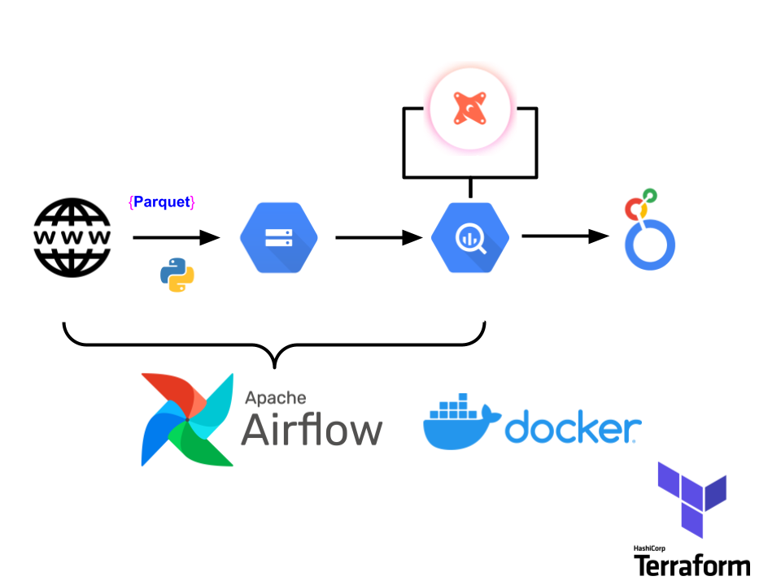
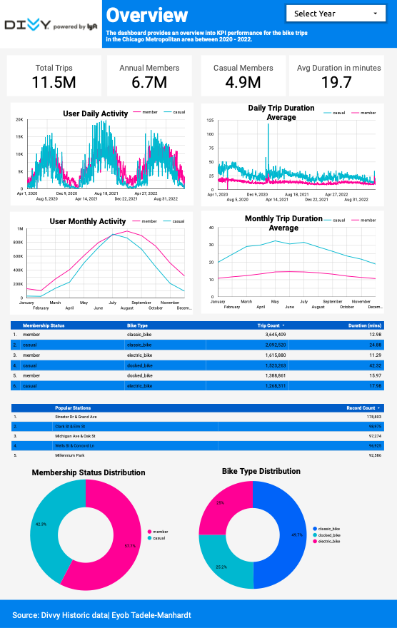
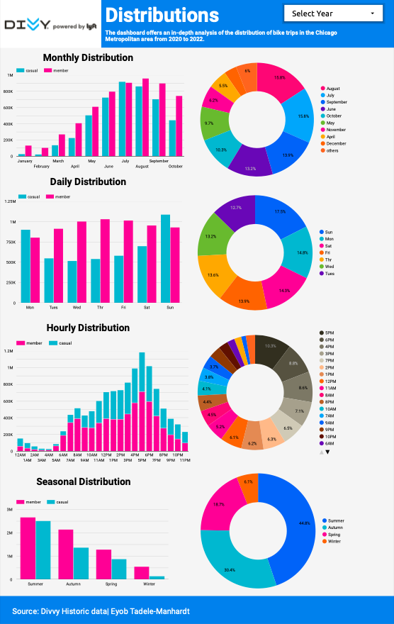
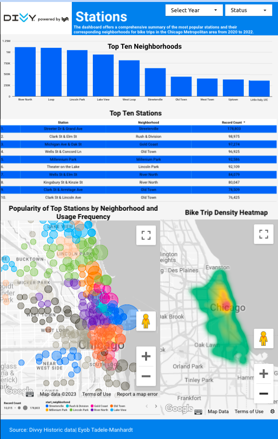

# Divvy Data Pipeline

## Overview
This repository aims to automate the analysis and investigation of Divvy's bikeshare project, as previously conducted and documented here: [Divvy's bikeshare project](https://github.com/ETM1123/Divvy-Bikeshare-Project). Unlike the previous project, data is stored and computations are conducted on the cloud through the utilization of Google Cloud Platform (GCP) to create a data pipeline for analysis. To facilitate the replication of this environment, we have provided a comprehensive step-by-step tutorial for interested users. Please follow the instructions provided in the tutorial to execute the code in this repository or to customize the environment for your own projects.
- [tutorial](https://github.com/ETM1123/divvy-data-pipeline/blob/main/tutorial.md)

## Technologies
The project leverages the following technologies for its implementation:
1. Google Cloud Platform (GCP):
    - Google Cloud Storage (GCS): stores raw data (Data Lake)
    - Google Bigquery: organizes data (Data warehouse)
    - Google Data Studio (Looker): provides visualization 
2. Terraform: Infrastructure as code (IaC) - creates project configuration for GCP to bypass cloud GUI.
3. Airflow: Workflow orchestration 
    - Python, Docker
4. DBT Cloud: Transform and prepare data for visualization 
    - SQL (Big Query)

## Architecture
The end-to-end process of the project is as follows:

0. Google Cloud project set up, Cloud bucket configuration: (GCP, Terraform)
1. Extract data from web, upload data to GCS: (Python, Airflow, Docker)
2. Move data from GCS to BigQuery: (GCP) or (Python, Airflow, Docker)
3. Transform and prepare data for visualization: (dbt)
4. Create Dashboards (Google Data Studio: Looker)

## Final Product
Our product includes three dashboards that offer different levels of analysis regarding the relationships between annual and casual members. The first dashboard, 'Overview', provides an overview of general member behaviors, including popular stations and riding patterns. The second dashboard, 'Distributions', provides deeper analysis by displaying the distribution of trips at various granular levels. Finally, the 'Stations' dashboard offers geo-location charts that allow users to identify areas with high traffic. We encourage you to explore these dashboards to discover your own insights. Please find the link to access the dashboard below. [link-to-dashboard](https://lookerstudio.google.com/reporting/2397a020-65d2-42a4-8f05-b36c7c6cadaf)

