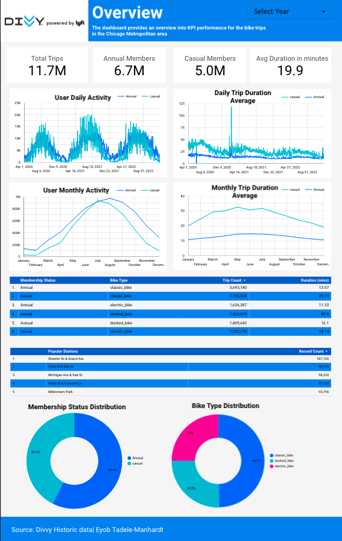

# Divvy Data Pipeline

## Overview
In this repo we will automate our previous [Divvy's bikeshare project](www.google.com) - where we analyzed and investigated the relationships between the annual and causal members who used Divvy's bikeshare services in the Chicago metropolitan areas. In the previous project, data was stored and computations were conducted locally. This repository scales the project by utilizing cloud platforms and creating a data pipeline for analysis. Google Cloud Platform (GCP) serves as the cloud service provider.

## Technologies
The project leverages the following technologies for its implementation:
1. Google Cloud Platform (GCP):
    - Google Cloud Storage (GCS): stores raw data (Data Lake)
    - Google Bigquery: organizes data (Data warehouse)
    - Google Data Studio (Looker): provides visualization 
2. Terraform: Infrastructure as code (IaC) - creates project configuration for GCP to bypass cloud GUI.
3. Airflow: Workflow orchestration 
    - Python, Docker
4. DBT Cloud: Transform and prepare data for visualization 
    - SQL (Big Query)

## Architecture
The end-to-end process of the project is as follows:

0. Google Cloud project set up, Cloud bucket configuration: (GCP, Terraform)
1. Extract data from web, upload data to GCS: (Python, Airflow, Docker)
2. Move data from GCS to BigQuery: (GCP) or (Python, Airflow, Docker)
3. Transform and prepare data for visualization: (dbt)
4. Create Dashboards (Google Data Studio: Looker)

## Final Product
Below is a screenshot of the current product. More updates to follow.

